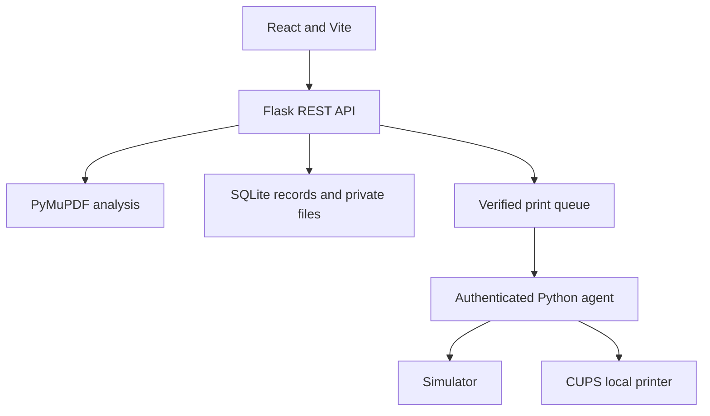

# AutoPrint AI

A SIH prototype for intelligent self-service printing. This version preserves your latest interface edits and is prepared for **one free Render Web Service**, with React and Flask on the same HTTPS address. The root opens **New Print**; `/home` opens the product introduction.

**To put it online, follow [DEPLOY_RENDER.md](DEPLOY_RENDER.md).** Render builds the supplied `Dockerfile`; `render.yaml` selects the Free instance and configures the demo. Deployment still needs to be completed in your Render account.

## What works

- PDF upload (10 MB, 150 pages), page count, conservative blank-page and color detection, private document preview.
- Six-step workflow: upload, analyze, configure, review, test payment, tracking.
- Copies, A4/A3, B&W/color/auto, duplex, page ranges, orientation, and optional blank-page removal. The pages-per-side control stays hidden and defaults to one in the UI; backend support remains intact.
- Server-calculated prices, configurable admin rates, saved orders, failed-payment simulation and retry.
- Private workspace, paid-only queue, pause/resume/cancel/reassign, printer management, profile preferences, CSV export. Data is saved locally; Render Free resets local data on sleep, restart, or redeploy.
- Live simulated queue progression and database-derived analytics. Sample records are labeled and filterable.
- A separate authenticated Python print agent, CUPS integration, a persistent submission journal, and simulation mode.
- Password-protected Flask administration at `/admin/login`, eight-hour admin sessions, and Sign out. Admin writes are checked by the API as well as the page guard.
- Your printing animation, highlighted queue/time, and Print another document button remain in place. Card, sample-PDF, and Just looking around options remain removed from the UI.

## Run the requested React + Flask version (Windows)

Install Python 3.12 and Node.js 24 LTS. Extract the archive and open two terminals in the project folder. Copy `.env.example` to `.env`, then set `ADMIN_PASSWORD` to your own password. `ADMIN_USERNAME` is `admin` by default. There is no built-in admin password. Keep `APP_ENV=development` and `COOKIE_SECURE=false` for localhost. No payment gateway, Raspberry Pi, or printer is required.

From PowerShell in the project folder (only when `.env` does not already exist):

```powershell
Copy-Item .env.example .env
notepad .env
```

Terminal 1:

```powershell
cd backend
python -m venv .venv
.venv\Scripts\python -m pip install -r requirements.txt
.venv\Scripts\python app.py
```

Terminal 2:

```powershell
cd frontend
npm.cmd ci
npm.cmd run dev
```

Open the URL printed by Vite (normally http://localhost:4173). Vite proxies `/api` to Flask at http://127.0.0.1:5000, so cookies and uploads use the same origin. Keep both terminals running. On macOS/Linux, use `.venv/bin/python` instead of `.venv\Scripts\python`.

Start Vite inside `frontend/` for the Flask version. The root developer command uses an alternative Worker adapter, which is not the Render deployment.

SQLite, private uploaded PDFs, and the generated local session secret are stored in `backend/data/`, which is excluded from source control. Keep this directory to preserve your local workspace. Each browser cookie identifies a separate workspace; clearing cookies starts another one. Admin management acts on the current browser's workspace, so upload and demonstrate administration in the **same browser profile**. This prototype does not provide one shared shop queue across different customers.

## SIH demonstration (about 2 minutes)

1. Open the website; New Print appears first. Upload a small PDF of your own.
2. Review detected pages, blank pages, and color pages, then choose print settings.
3. Check the server-calculated price and continue to the simulated UPI/QR payment.
4. Verify the test payment. You can demonstrate a failed payment and retry first.
5. Keep the tracking page open to see queue progression, printing, and completion (about 30 seconds when the simulated printer is available).
6. Choose **Print another document** to start again.
7. Open **Admin workspace**, sign in, and manage pricing or printers. Choose **Sign out** when finished.

## Render deployment and alternative Worker files

Render runs **Flask with Gunicorn**, using PyMuPDF for server-side PDF analysis. Docker first builds the React frontend with Node 24, then copies the compiled public files into a Python 3.12 image. Flask serves the UI and `/api` together, including direct links such as `/admin/pricing`. The service listens on Render's `PORT`; `/healthz` is the health check.

The supplied `worker/`, root package scripts, and `.openai/` files belong to the earlier alternative Worker deployment. They are preserved, but Render does not use them. The Flask login and hosting changes in this package have not been ported to that alternative runtime. Use the frontend-folder commands above and the Render guide for this version.

To build just the React frontend from the project root:

```sh
npm --prefix frontend ci
npm --prefix frontend run build
```

Output is `dist/client/`. On Render this is automatic, and Docker installs only the frontend dependencies. No advanced ML, OCR, live payment integration, or physical hardware testing is claimed.

## Architecture



```
frontend/src/
  components/       Layout, reusable UI, charts, modal
  pages/            Dashboard, new print, jobs, management, landing
  hooks/            Workspace polling and shared state
  services/         API client and browser PDF analysis
backend/
  app.py            Flask routes, session ownership, request validation
  config.py         Environment and private local data paths
  services/         PDF, pricing, queue, payment, analytics, insights, storage
  test_workflow.py  API integration test using an isolated temporary database
print_agent/
  agent.py          Authenticated polling and persistent submission journal
  printer_service.py
  cups_service.py   Actual CUPS integration (loaded only for real mode)
  config.py
worker/             Hosted API and shared domain logic
scripts/            Build, local hosted adapter, hosted regression test
 db/schema.ts       D1 schema; generated migrations live in drizzle/
```

## Pricing rules

All prices come from one stored rate record per workspace and are recalculated on the server when an order is created. Existing order quotes do not change when admin rates change.

| Default rate          |   INR |
| --------------------- | ----: |
| A4 B&W single side    |  1.00 |
| A4 B&W duplex sheet   |  1.50 |
| A4 color printed side |  5.00 |
| A3 B&W single side    |  3.00 |
| A3 B&W duplex sheet   |  4.50 |
| A3 color printed side | 10.00 |

Page ranges are validated, sorted, and deduplicated. Blank-page removal happens before imposition. Multiple pages per side are grouped before pricing; an imposed side containing color is treated as color in Auto mode. Each pair of B&W sides uses the duplex sheet rate. An unpaired B&W side uses the single-side rate. Copies multiply the result. Sheets saved compares this configuration with one selected original page per sheet, for the same number of copies.

## Raspberry Pi agent

For the standalone agent simulator:

1. Run the Flask version, create a workspace, and copy the workspace ID from Admin > System Settings.
2. In `.env`, set a long random `PRINT_AGENT_TOKEN` (generate locally with `python -c "import secrets; print(secrets.token_hex(32))"`), `PRINT_WORKSPACE` to that workspace, and the relevant `PRINT_AGENT_PRINTER_ID` (e.g. `pi-01`). Keep tokens out of Git.
3. Set `PRINT_MODE=agent` to disable the API’s internal simulator, `AGENT_MODE=simulation`, and `ALLOW_TEST_PRINTING=true` to explicitly authorize the simulator to process test-paid jobs.
4. Restart Flask. Run `python print_agent/agent.py` in a third terminal with the same dependencies installed.

For a controlled physical-printer prototype, configure a local CUPS printer on the Pi, install pycups in the agent environment, set `AGENT_MODE=real`, and set `CUPS_PRINTER_NAME` to the exact local queue name. CUPS must remain on the private network. The agent makes outbound authenticated requests; no printer port is exposed publicly. `ALLOW_TEST_PRINTING=true` is an explicit opt-in to print controlled test jobs physically. Leave it false for normal operation.

The agent downloads only backend-selected pages, honors CUPS copies/media/sides/imposition/color/orientation options, and checks CUPS job-state before reporting completion. Its local journal prevents automatic duplicate physical submissions after restart. Ambiguous submissions stop for operator reconciliation. Hardware failures and specific driver support have **not** been tested against a physical printer. The hosted website intentionally does not authorize a real agent; use the Flask service for hardware work.

## Payment integration boundary

The current payment service is **test only**, with no real money movement and no payment secrets in the frontend. UPI and QR code are selectable mock methods; Card stays hidden. Test payment verification happens on the server and only verified jobs enter the queue. Setting `DEMO_MODE=false` disables mock verification; it does not enable live payments. The integration point for a future gateway is `backend/services/payment_service.py`.

## Storage and security

- UUID document IDs and workspace ownership checks; private bytes are returned only through the owned-document API.
- HTTP-only same-site session cookies, origin checks on mutations, file signature/size/page-count validation, prepared SQL, and request-rate limiting.
- Local development binds to loopback. Render runs Gunicorn behind its HTTPS proxy; production cookies use Secure, HttpOnly, and SameSite=Strict.
- Flask admin writes require an authenticated administrator session or an explicitly configured `X-Admin-Token`. Production startup requires a random session secret and an admin password of at least 12 characters. Configure these in Render, never in source code. This remains a demonstration, not a shared production billing system.
- Database tables store workspace-scoped JSON records to keep the prototype repositories small. `users`, `documents`, `print_jobs`, `payments`, `printers`, `printer_status`, and `pricing` are actively persisted. Analytics/resources/insights are computed from jobs; their reserved tables support future materialized summaries. A production PostgreSQL migration should normalize queried job fields and add indexes based on actual reporting queries.
- The simulator advances persisted jobs when an API request runs; the UI polls every four seconds. It is a deterministic demo, not an always-running hardware daemon. Only one active job per printer is advanced at a time.

## Verification

```sh
npm --prefix frontend ci
npm --prefix frontend run build
python backend/test_workflow.py
python backend/test_deployment.py
```

Run Python commands using the virtual environment from the local setup instructions. Tests use isolated temporary data. They cover PDF analysis, invalid uploads/ranges, document ownership, quotes, payment failure/retry/idempotency, queue completion, analytics, admin authentication/logout/expiry, HTTPS forwarding, production credential requirements, static assets, and direct page routes.

The current frontend build and Flask tests passed during preparation. Browser preview was unavailable in the preparation environment, so visual verification of this uploaded version is still required after deployment. The Docker image and live Render deployment have not been tested here; Render performs the image build when you create the service.
